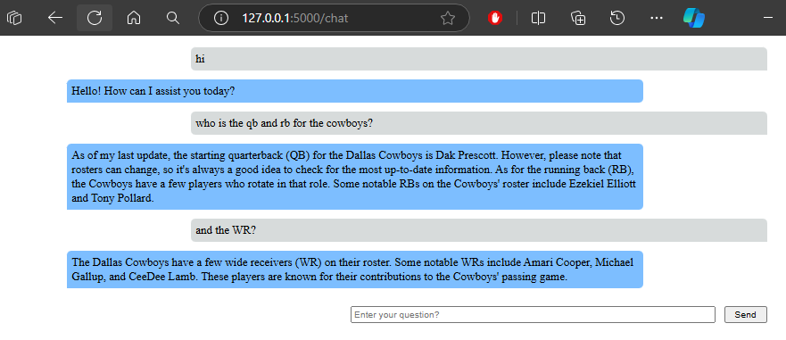

# Flask GPT Basics with Azure OpenAI  
   
Welcome to the Flask GPT Basics project! This guide will help you understand how to integrate Azure OpenAI into a Flask web application. We'll explain key components and concepts you'll use to create a chat application with and without chat history.  


   
## Prerequisites  
   
- Basic understanding of Python and Flask  
- Azure OpenAI API key and endpoint  
- GitHub account with access to Codespaces  
   
## Setup  
   
1. Clone the repository and navigate to the project directory:  
    ```bash  
    cd demo/flask_gpt_basics  
    ```  
   
2. Run the Flask application:  
    ```bash  
    python app.py  
    ```  
   
## Routes Overview  
   
The application has three main routes: `/test-ai`, `/ask`, and `/chat`. Each route serves a different purpose:  
   
1. **`/test-ai`**: A simple form to ask a question without keeping chat history.  
2. **`/ask`**: Similar to `/test-ai` but uses an HTML template for the form.  
3. **`/chat`**: The main chat route that maintains chat history for a more coherent conversation.  
   
## Key Concepts and Components  
   
### `get_response` Function  
   
The `get_response` function is responsible for sending the user's question and chat history to the Azure OpenAI API and getting a response.  
   
- **Parameters**:  
  - `question`: The user's question.  
  - `chat_history`: The previous messages in the conversation.  
   
- **Process**:  
  - It creates a message history, including the system message and user messages.  
  - It sends this history to the Azure OpenAI API.  
  - It returns the AI's response.  
   
### `contextless_message` Route  
   
This route handles POST requests to get a response from the AI without using chat history.  
   
- **Process**:  
  - Retrieves the question from the POST request.  
  - Calls the `get_response` function with the question.  
  - Returns the AI's response.  
   
### `sendMessage` Function (JavaScript)  
   
This function handles sending the user's question to the backend and updating the chat interface with the AI's response.  
   
- **Process**:  
  - Collects the question and current chat history.  
  - Sends this data to the `/chat` route using a POST request.  
  - Updates the chat interface with the user's question and the AI's response.  
   
### HTTP Methods: GET and POST  
   
- **GET**: Used to request data from the server. For example, when you load the chat page.  
- **POST**: Used to send data to the server. For example, when you send a question to the AI.  
   
### `request.form.get`  
   
- This method retrieves data sent in a form submission.   
- For example, `request.form.get("question")` gets the value of the `question` input field from the form submitted by the user.  
   
## Example Explanation  
   
### Sending a Question  
   
1. **User Input**: The user types a question in the input field and clicks "Send".  
2. **JavaScript `sendMessage` Function**:  
   - Collects the question and chat history.  
   - Sends a POST request to the `/chat` route with this data.  
3. **Backend Processing**:  
   - The Flask app receives the request.  
   - The `chat` route extracts the question and chat history.  
   - The `get_response` function sends this data to Azure OpenAI and gets a response.  
4. **Updating the Interface**:  
   - The response is sent back to the frontend.  
   - The chat interface updates to show the user's question and the AI's response.  
   
### Example Chat Interface  
   

   
This image shows how the chat interface looks. Users can enter their questions, and the AI responds based on the current conversation context.  
   
## Running the Application  
   
To run the application, simply navigate to the project directory and execute:  
   
```bash  
cd demo/flask_gpt_basics  
python app.py  
```  
   
Open your web browser and go to `http://127.0.0.1:5000/chat` to start chatting with the AI. You can also test the `/test-ai` and `/ask` routes for basic AI interactions without chat history.  